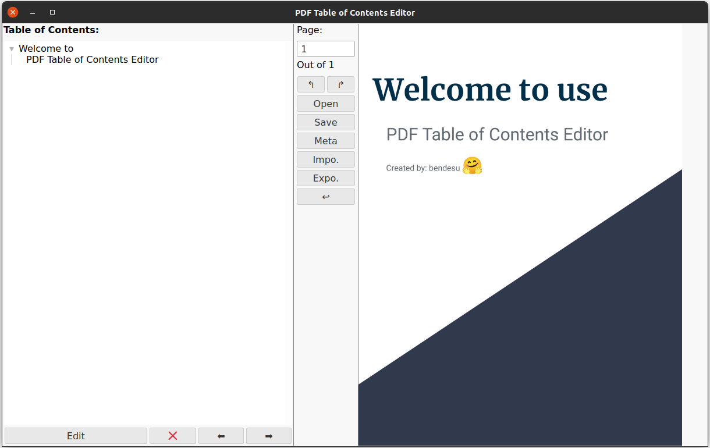

# PDF-Table-of-Contents-Editor
PDF Table of Contents Editor is an easy-to-use tool that enables you to edit the table of contents and metadata of your PDFs.

## Run the program:
```
git clone https://github.com/bendesu/PDF-Table-of-Contents-Editor.git
cd PDF-Table-of-Contents-Editor
pip install -r requirements.txt
python main.py
```


## Download the standalone AppImage:
### [Google Drive](https://drive.google.com/file/d/1_dqpLYrrk99gKb-XV7YOtlD8q3A6dyVk/view?usp=sharing)