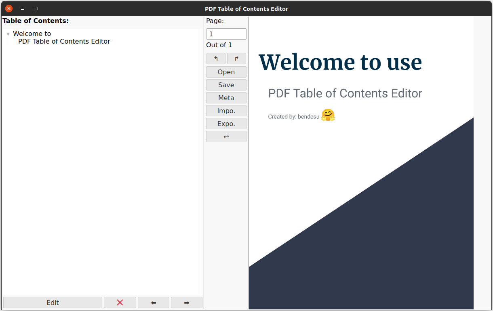

# PDF-Table-of-Contents-Editor
PDF Table of Contents Editor is an easy-to-use tool that enables you edit the table of contents and metadata of your PDFs.

## To run the program:
```
python main.py
```
